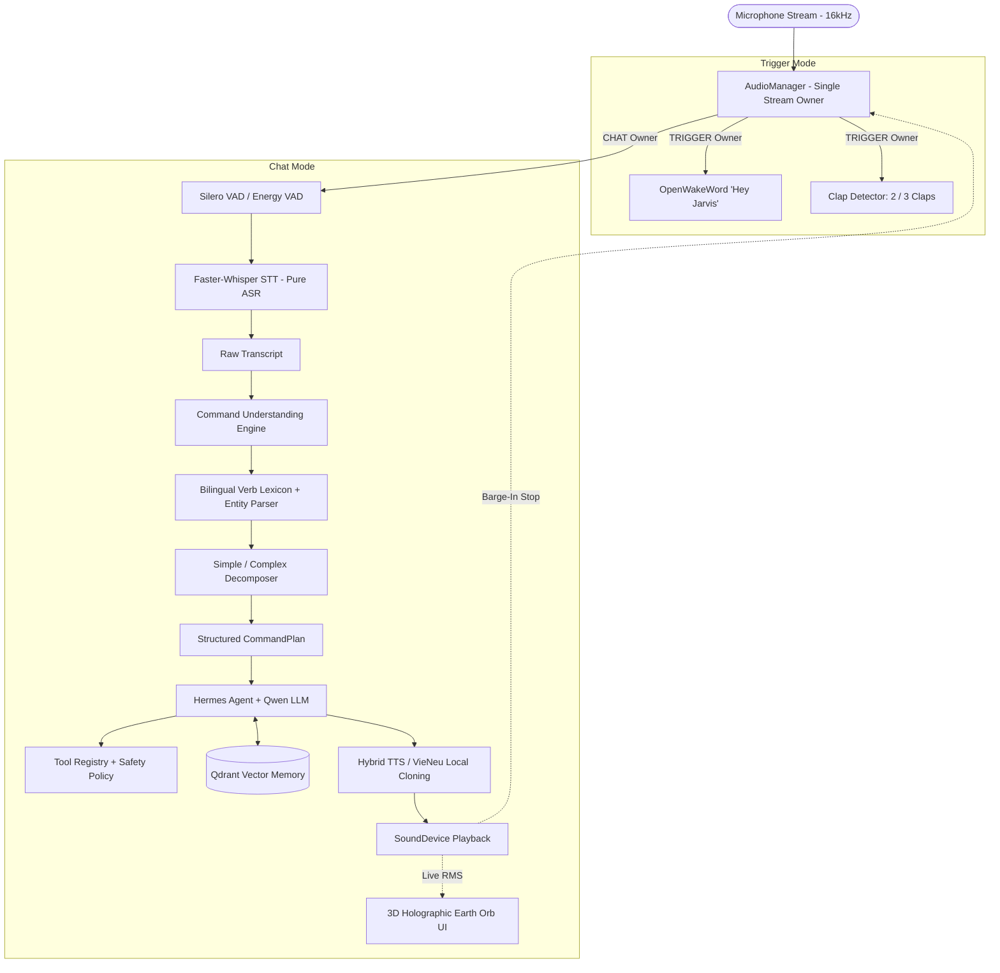

# Jarvis — AI Desktop Voice Assistant & Agent Architecture

[](docs/JARVIS_SYSTEM_ARCHITECTURE.md)
[-brightgreen)](tests/run_all_tests.py)
[]()
[]()

Jarvis is an intelligent, context-aware desktop AI voice operating environment designed for Windows. It combines zero-latency acoustic trigger detection (claps & wake words), pure multilingual speech-to-text recognition (Faster-Whisper), an independent data-driven Command Understanding Engine (Bilingual Verb Lexicon + Multi-Step Decomposer), Large Language Model reasoning (Qwen), autonomous agent planning (Hermes), typed computer-use automation, long-term vector memory (Qdrant), and hybrid voice synthesis (ElevenLabs + VieNeu-TTS) paired with a reactive 3D Holographic Earth Orb UI.

---

## 📖 Complete Technical Documentation

> 📄 **For full technical specifications, component deep-dives, pipeline lifecycles, and configuration references, see the central technical source of truth:**  
> 👉 [**`docs/JARVIS_SYSTEM_ARCHITECTURE.md`**](docs/JARVIS_SYSTEM_ARCHITECTURE.md)

---

## 🌟 Key Features

* **Single Microphone Ownership:** Strict mutex ensures VAD, STT, and Clap detection never conflict over the audio stream.
* **Strict ASR Decoupling:** Faster-Whisper performs pure Speech-To-Text ($Audio \rightarrow Text$) with zero business logic or command prompt injection.
* **Independent Command Understanding Engine:** Dedicated bilingual Verb Lexicon (`CanonicalVerb`), entity/parameter extraction, simple/complex multi-step decomposition, and execution dependency graphs.
* **Multilingual Input $\rightarrow$ English Output:** Spoken commands can be in English, Vietnamese, or Code-Switching Mixed, while Jarvis AI responses are **always synthesized in natural English**.
* **Instant Speech Barge-In:** User speech detected during TTS playback immediately halts audio output and switches to listening mode.
* **LLM Reasoning & Agent Loop:** Qwen LLM plans and executes multi-step computer tasks via the Hermes Agent runtime with fallback reasoning.
* **11 Typed Automation Tools:** Window snapping, browser tab navigation, application launching, system telemetry, and YouTube controls with `SafetyPolicy` destructive command filtering.
* **Long-Term Vector Memory:** Persistent semantic memory powered by Qdrant embedded vector database.
* **Hybrid TTS Model:** ElevenLabs bootstraps initial reference WAV voice datasets, while local VieNeu-TTS performs zero-credit runtime voice synthesis.
* **Zero UI Regression:** 100% backward compatible with the existing Three.js 3D Earth Orb UI and WebSocket protocol (`ws://127.0.0.1:8765`).

---

## 🏛️ High-Level System Architecture



---

## 🚀 Quick Start

### 1. Installation

```bash
# Clone repository
git clone https://github.com/kaliber2602/jarvis.git
cd jarvis

# Create virtual environment
python -m venv venv
venv\Scripts\activate

# Install dependencies
pip install -r requirements.txt
pip install faster-whisper qdrant-client ctranslate2 torch
```

### 2. Configuration (`.env`)

Create a `.env` file in the root directory (see [Configuration Guide](docs/JARVIS_SYSTEM_ARCHITECTURE.md#24-configuration--environment-variables-reference)):

```env
# Text-to-Speech Mode: hybrid | vieneu | elevenlabs | system
TTS_MODE=hybrid
ELEVENLABS_API_KEY=your_api_key_here
ELEVENLABS_VOICE_ID=IXXiMMkScyYf0VAI4AFp
ELEVENLABS_SAMPLE_COUNT=20

# Speech-to-Text: faster-whisper | vosk | google
STT_PROVIDER=faster-whisper
STT_MODEL=base

# Qwen LLM Provider Endpoint (Ollama / vLLM / Local)
QWEN_API_URL=http://localhost:11434/v1
QWEN_MODEL=qwen2.5:7b

# Qdrant Vector Storage
QDRANT_STORAGE_PATH=./data/qdrant
```

### 3. Launch Jarvis

```bash
python jarvis.py
```

* **Activate Conversation:** Say *"Hey Jarvis, I need your help"* or *"Jarvis ơi"*.
* **Double Clap:** Automatically sets up workspace (VS Code, Google Chrome, Antigravity).
* **Triple Clap:** Initiates cancelable 5-second shutdown countdown.
* **Dismiss:** Say *"Jarvis, go to sleep"* or *"Nghỉ ngơi đi"*.

---

## 🧪 Testing & Verification

Run the master integration test suite:

```bash
python tests/run_all_tests.py
```

```text
======================================================================
 JARVIS VOICE ENGINE & AGENT ARCHITECTURE - INTEGRATION TEST SUITE
======================================================================
[1/9] Running test_vad.py... [PASSED]
[2/9] Running test_audio_manager.py... [PASSED]
[3/9] Running test_smart_stt.py... [PASSED]
[4/9] Running test_normalizer.py... [PASSED]
[5/9] Running test_language_detector.py... [PASSED]
[6/9] Running test_agent.py... [PASSED]
[7/9] Running test_tts_pipeline.py... [PASSED]
[8/9] Running test_playback_barge_in.py... [PASSED]
[9/9] Running test_memory.py... [PASSED]
======================================================================
TEST SUMMARY: 9/9 PASSED in 22.56s
ALL TESTS PASSED SUCCESSFULLY!
```

---

## 🎙️ Voice Command Quick Reference

| Action | English Phrase | Vietnamese Phrase |
| :--- | :--- | :--- |
| **Wake & Chat** | *"Hey Jarvis, I need your help"* | *"Jarvis ơi"* / *"Gọi Jarvis"* |
| **Sleep / Dismiss** | *"Jarvis, go to sleep"* | *"Đi ngủ đi"* / *"Nghỉ ngơi đi"* |
| **Snap Left** | *"Snap left"* / *"Half left"* | *"Kéo sang trái"* / *"Nửa trái"* |
| **Snap Right** | *"Snap right"* / *"Half right"* | *"Kéo sang phải"* / *"Nửa phải"* |
| **Maximize** | *"Maximize window"* / *"Fullscreen"* | *"Phóng to"* / *"Toàn màn hình"* |
| **Minimize** | *"Minimize window"* | *"Thu nhỏ cửa sổ"* / *"Ẩn cửa sổ"* |
| **Next Tab** | *"Next tab"* | *"Tab tiếp theo"* / *"Chuyển tab"* |
| **Close Window** | *"Close window"* / *"Close Chrome"* | *"Đóng cửa sổ"* / *"Tắt cửa sổ"* |
| **Search Web** | *"Search for machine learning"* | *"Tìm kiếm tài liệu Python"* |
| **YouTube Play** | *"Play second video"* | *"Chọn video thứ hai"* |
| **System Status**| *"System status"* / *"Battery"* | *"Kiểm tra hệ thống"* |

---

## 🛡️ Compatibility & Invariants

* **No UI Changes:** Existing Three.js 3D Orb overlay operates over WebSocket (`ws://127.0.0.1:8765`) unchanged.
* **No Logic Regressions:** All existing clap shortcuts, deterministic commands, and welcome phrase audio caches remain operational.
* **Complete Technical Reference:** Read [**`docs/JARVIS_SYSTEM_ARCHITECTURE.md`**](docs/JARVIS_SYSTEM_ARCHITECTURE.md) for full architectural specifications.
