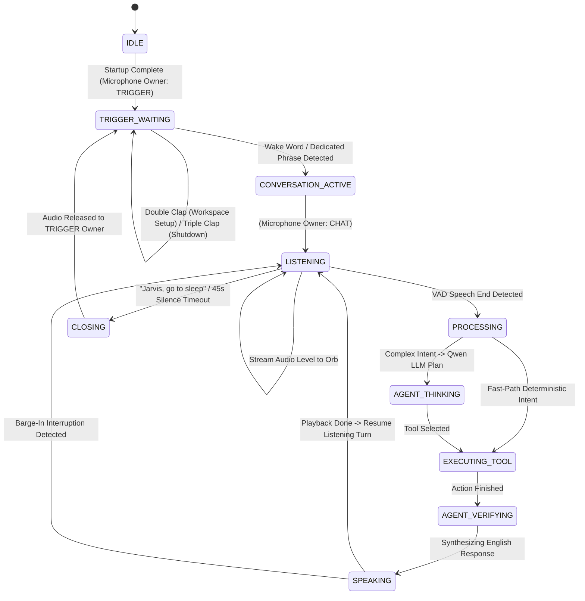

# JARVIS — Complete System Architecture & Runtime Documentation

> **Document Purpose:** Single Central Technical Reference & Source of Truth for the Jarvis Voice Engine & Agent Architecture.  
> **Status:** Production-Ready / Fully Verified  
> **Last Verified:** 2026-08-29  
> **Test Suite Status:** 9/9 Test Suites Passing (100%)

---

## Table of Contents

1. [System Overview](#1-system-overview)
2. [Architecture Principles](#2-architecture-principles)
3. [Repository Structure](#3-repository-structure)
4. [End-to-End Architecture](#4-end-to-end-architecture)
5. [Complete Runtime Pipeline](#5-complete-runtime-pipeline)
6. [Application Startup Lifecycle](#6-application-startup-lifecycle)
7. [Audio & Microphone Architecture (Single Ownership Invariant)](#7-audio--microphone-architecture-single-ownership-invariant)
8. [Voice Activity Detection (VAD) Architecture](#8-voice-activity-detection-vad-architecture)
9. [Speech-to-Text (STT) Architecture](#9-speech-to-text-stt-architecture)
10. [Language Detection & Multilingual Strategy](#10-language-detection--multilingual-strategy)
11. [Multi-Tier Transcript Normalization](#11-multi-tier-transcript-normalization)
12. [Qwen LLM Reasoning Layer](#12-qwen-llm-reasoning-layer)
13. [Hermes Agent Runtime Engine](#13-hermes-agent-runtime-engine)
14. [Tool Registry & Safety Enforcement](#14-tool-registry--safety-enforcement)
15. [Long-Term Semantic Memory (Qdrant)](#15-long-term-semantic-memory-qdrant)
16. [Text-to-Speech (TTS) Provider Architecture](#16-text-to-speech-tts-provider-architecture)
17. [ElevenLabs Voice Asset Generation Pipeline](#17-elevenlabs-voice-asset-generation-pipeline)
18. [VieNeu-TTS Runtime Voice Synthesis](#18-vieneu-tts-runtime-voice-synthesis)
19. [Voice Profile Abstraction](#19-voice-profile-abstraction)
20. [Audio Playback Engine](#20-audio-playback-engine)
21. [Barge-In & Speech Interruption](#21-barge-in--speech-interruption)
22. [UI & 3D Holographic Earth Orb Communication](#22-ui--3d-holographic-earth-orb-communication)
23. [Provider & Fallback Architecture Matrix](#23-provider--fallback-architecture-matrix)
24. [Configuration & Environment Variables Reference](#24-configuration--environment-variables-reference)
25. [Recommended Deployment `.env` Profiles](#25-recommended-deployment-env-profiles)
26. [Model Lifecycle & Resource Management](#26-model-lifecycle--resource-management)
27. [Runtime State Machine](#27-runtime-state-machine)
28. [Error Handling & Resilience](#28-error-handling--resilience)
29. [Structured Diagnostic Logging](#29-structured-diagnostic-logging)
30. [Testing & Verification Suite](#30-testing--verification-suite)
31. [Installation & Developer Setup](#31-installation--developer-setup)
32. [Running Jarvis](#32-running-jarvis)
33. [Troubleshooting Guide](#33-troubleshooting-guide)
34. [Development & Extension Guidelines](#34-development--extension-guidelines)
35. [Backward Compatibility Guarantees](#35-backward-compatibility-guarantees)
36. [Known Limitations](#36-known-limitations)
37. [Architecture Summary](#37-architecture-summary)

---

## 1. System Overview

**Jarvis** is a zero-latency, context-aware desktop AI assistant and voice operating environment designed for Windows. It integrates wake-word detection, acoustic clap triggers, multi-lingual speech recognition, neural voice activity detection (VAD), semantic reasoning via Large Language Models (LLM), tool-augmented computer-use automation, long-term vector memory, and hybrid voice synthesis into a cohesive system.

### Core System Subsystems:
* **Voice Engine (`audio/`, `agent/stt/`, `agent/language/`):** Captures microphone frames with single-stream exclusivity, applies neural VAD, transcribes English and Vietnamese speech with Faster-Whisper, and detects input language.
* **Agent Runtime (`agent/hermes_runtime.py`, `agent/llm/`):** Coordinates intention interpretation, LLM planning (Qwen), and multi-step tool execution with structured event callbacks.
* **Tool Execution Layer (`agent/tools/`, `agent/tool_registry.py`):** Executes deterministic desktop automation (window snapping, browser tab switching, application lifecycle, YouTube controls) with safety policy validation.
* **Long-Term Memory (`agent/memory/`):** Stores user preferences, project facts, and conversation context in a local Qdrant vector database.
* **Hybrid TTS & Voice Assets (`audio/tts/`, `audio/playback.py`):** Leverages ElevenLabs for initial voice sample generation and local VieNeu-TTS for zero-credit runtime voice synthesis, streamed smoothly to speakers with instant barge-in support.
* **Holographic 3D UI (`ui/`, `runtime_bridge.py`):** Renders a Three.js WebGL Earth Orb that responds to voice volume levels and system state via a WebSocket bridge (`ws://127.0.0.1:8765`).

---

## 2. Architecture Principles

1. **Strict Single Microphone Ownership:**  
   Only one component or listener can consume the audio input stream at any time (`AudioManager`). VAD, STT, and Clap triggers never open concurrent conflicting microphone streams.
2. **Additive & Non-Breaking Evolution:**  
   New architectural layers wrap and extend legacy functionality without altering existing UI protocols, window layouts, hotkeys, or clap triggers.
3. **Provider Abstraction Layer:**  
   Every major subsystem (VAD, STT, LLM, TTS, Memory) adheres to an abstract base class (`ABC`), allowing instant swap-outs between local and cloud providers.
4. **Resilient Cascading Fallback:**  
   Every subsystem has an offline or deterministic fallback (e.g., Faster-Whisper $\rightarrow$ Google $\rightarrow$ Vosk; VieNeu $\rightarrow$ ElevenLabs $\rightarrow$ Windows SAPI; Qwen LLM $\rightarrow$ Rule-based Heuristic Planner).
5. **Model Lifecycle Reuse (Singleton Caching):**  
   Heavy neural models (Silero VAD, Faster-Whisper, OpenWakeWord) are loaded once and reused across sessions, avoiding redundant memory overhead or initialization latency.
6. **Input-to-Output Invariant:**  
   Spoken input can be Vietnamese, English, or Code-Switching Mixed, but Jarvis AI responses are **ALWAYS synthesized in natural, concise English**.

---

## 3. Repository Structure

```text
jarvis-main/
├── .cache/                     # Local disk caches for TTS phrases and welcome audio
│   ├── jarvis_tts/             # Runtime synthesized phrase WAV cache
│   └── jarvis_welcome/         # Pre-warmed boot welcome phrase WAV cache
├── agent/                      # Intelligence, STT, Language, Planning & Tools
│   ├── language/               # Language Detection Subsystem
│   │   ├── __init__.py
│   │   └── detector.py         # Multi-signal VI/EN/Mixed LanguageDetector
│   ├── llm/                    # Large Language Model Providers
│   │   ├── __init__.py
│   │   └── qwen_provider.py    # Qwen LLM reasoning, planning, and response generation
│   ├── memory/                 # Long-Term Semantic Vector Memory
│   │   ├── __init__.py
│   │   └── memory_service.py   # Qdrant vector memory service and item models
│   ├── stt/                    # Speech-to-Text Provider Layer
│   │   ├── __init__.py
│   │   └── stt_provider.py     # Faster-Whisper, Vosk, Google STT providers
│   ├── tools/                  # Computer-Use Tools & Automation
│   │   ├── __init__.py
│   │   ├── browser_tool.py     # Chrome & Web browsing tools
│   │   ├── computer_use.py     # Windows API window/mouse/keyboard tools
│   │   └── system_tool.py      # System telemetry, metrics, and file discovery
│   ├── agent_events.py         # Hermes agent lifecycle event definitions
│   ├── app_registry.py         # Curated catalog of desktop application aliases
│   ├── base_client.py          # Abstract agent client dataclasses
│   ├── command_router.py       # Intent router: Deterministic vs. Agent vs. Sleep
│   ├── hermes_client.py        # Hermes runtime async client interface
│   ├── hermes_runtime.py       # Hermes agent execution engine & reasoning loop
│   ├── normalizer.py           # EntityResolver, IntentResolver, InterpretationContext
│   ├── normalizer_layers.py    # Rule, Dictionary, LLM, and Hybrid Normalizer tiers
│   ├── phonetics.py            # Vietnamese transliteration & phonetic fuzzy matching
│   ├── safety_policy.py        # Destructive command filtering & safety verification
│   ├── smart_stt.py            # SmartSTT engine & deduplication adapter
│   ├── tool_registry.py        # Central typed tool catalog with safety levels
│   └── voice_memory.py         # Self-learning phonetic correction store
├── audio/                      # Audio Pipeline, VAD, TTS & Playback
│   ├── tts/                    # Text-to-Speech Engine
│   │   ├── __init__.py
│   │   ├── tts_provider.py     # VieNeu, ElevenLabs, System SAPI, Hybrid providers
│   │   ├── voice_asset_generator.py # ElevenLabs voice dataset bootstrapper
│   │   ├── voice_dataset.py    # Local voice dataset management & metadata.json
│   │   └── voice_profile.py    # Provider-independent VoiceProfile model
│   ├── audio_manager.py        # Single microphone ownership & barge-in manager
│   ├── playback.py             # SoundDevice non-blocking chunked playback engine
│   ├── vad.py                  # AudioVAD wrapper adapter
│   └── vad_provider.py         # SileroVADProvider (neural) & EnergyVADProvider
├── data/                       # Local persistent data storage
│   └── qdrant/                 # Local on-disk Qdrant vector database storage
├── docs/                       # Architecture documentation
│   └── JARVIS_SYSTEM_ARCHITECTURE.md # (This File) Central source of truth
├── tests/                      # Comprehensive Unit & Integration Test Suite
│   ├── run_all_tests.py        # Master test runner (9/9 suites)
│   ├── test_agent.py           # Hermes agent loop & tool execution tests
│   ├── test_audio_manager.py   # Microphone ownership & listener test
│   ├── test_integration.py     # End-to-end routing & flow tests
│   ├── test_language_detector.py # VI / EN / Mixed detection tests
│   ├── test_memory.py          # Qdrant vector memory storage & search tests
│   ├── test_normalizer.py      # Normalization & entity resolution benchmark tests
│   ├── test_playback_barge_in.py # Audio playback streaming & barge-in tests
│   ├── test_smart_stt.py       # SmartSTT deduplication & transcription tests
│   ├── test_tts_pipeline.py    # VoiceDataset, Profile, Asset Generator & TTS tests
│   └── test_vad.py             # Silero & Energy VAD provider tests
├── ui/                         # 3D Three.js WebGL Holographic Earth Orb
│   ├── app.js                  # Frontend WebSocket client & state controller
│   ├── index.html              # Orb viewport markup
│   ├── orb.js                  # Three.js particle sphere & shader visualizer
│   └── style.css               # Transparent frameless CSS layout
├── .env                        # Active runtime environment configuration
├── jarvis.py                   # Central daemon entrypoint & runtime coordinator
├── requirements.txt            # Python package dependencies
├── runtime_bridge.py           # WebSocket server bridge for Orb UI (Port 8765)
├── serve_orb.py                # Standalone HTTP preview server for Orb UI
├── ui_window.py                # PyWebView frameless transparent overlay launcher
└── user_voice_memory.json      # Persistent learned phonetic correction mappings
```

---

## 4. End-to-End Architecture

```mermaid
flowchart TD
    MIC([Microphone Stream - 16kHz Mono]) --> AM[AudioManager - Single Stream Owner]

    subgraph Trigger Mode (Waiting)
        AM -->|TRIGGER Owner| OWW[OpenWakeWord 'Hey Jarvis']
        AM -->|TRIGGER Owner| CLAP[Clap Detection: 2 Claps / 3 Claps]
        AM -->|TRIGGER Owner| VOSK_WAIT[Vosk Quick Command Matcher]
    end

    subgraph Chat Mode (Continuous Conversation)
        AM -->|CHAT Owner| VAD[Silero VAD / Energy VAD Provider]
        VAD -->|Speech Boundary Frames| STT[Faster-Whisper STT / Google Fallback]
        STT -->|Raw Spoken Text| LANG[LanguageDetector: VI / EN / Mixed]
        LANG --> NORM[Hybrid Normalizer: Rule + Dict + Small LLM]
        NORM -->|InterpretationContext| ROUTER[Command Router]
        
        ROUTER -->|Fast-Path| EXEC_DIRECT[Deterministic Window / App Tool]
        ROUTER -->|Complex Intent| HERMES[Hermes Agent Runtime + Qwen LLM]
        
        HERMES --> TOOLS[ToolRegistry + Safety Policy Enforcement]
        HERMES <--> MEMORY[(Qdrant Vector Memory)]
        HERMES -->|English Text Response| TTS[Hybrid TTS / VieNeu Local Cloning]
        
        TTS --> PLAY[SoundDevicePlayback - Chunked Stream]
        PLAY --> SPK([Speakers / Output Device])
        PLAY -.->|Live RMS Level| WS[JarvisBridge WebSocket: 8765]
        WS --> ORB[3D Holographic Earth Orb UI]
        
        AM -.->|Energy Spike Above Noise Floor| BARGE[Barge-In Interruption Handler]
        BARGE -.->|Stop Signal| PLAY
    end
```

---

## 5. Complete Runtime Pipeline

| Stage | Input | Processing | Output | Implementation | Fallback |
| :--- | :--- | :--- | :--- | :--- | :--- |
| **1. Audio Capture** | Microphone hardware | 16-bit Float32 PCM streaming at 16000 Hz, chunk size 40–80 ms. | ndarray audio block | `audio/audio_manager.py` | Graceful log & stream re-open |
| **2. Trigger Detection** | Raw audio frame | RMS peak analysis for claps; OpenWakeWord neural inference for wake phrase. | Trigger event / Wake session | `jarvis.py` | Fallback to direct voice trigger |
| **3. VAD Framing** | Audio frame | Silero neural model computes speech probability. State machine manages speech start/end. | Speech boundary & full PCM bytes | `audio/vad_provider.py` | EnergyVADProvider (adaptive RMS) |
| **4. Speech-to-Text** | 16-bit PCM bytes | Faster-Whisper transcribes speech with beam search and diacritic preservation. | `STTResult` (text, lang, prob) | `agent/stt/stt_provider.py` | Google Web Speech $\rightarrow$ Vosk Kaldi |
| **5. Language Detection** | Transcribed text | Diacritic regex, fastText, and vocabulary frequency classify language type. | `LanguageType` (`vi`, `en`, `mixed`) | `agent/language/detector.py` | Default to `en` response rule |
| **6. Normalization** | Raw transcript | Whitespace cleaning, phonetic transliteration, alias expansion, small LLM fallback. | `InterpretationContext` | `agent/normalizer_layers.py` | Passthrough raw cleaned string |
| **7. Reasoning & Plan** | Spoken intent & context | Qwen LLM / Hermes Agent evaluates available tool schemas and plans steps. | Multi-step Action Plan + English reply | `agent/hermes_runtime.py` | Heuristic deterministic planner |
| **8. Tool Execution** | Action call & params | `ToolRegistry` validates schema, checks `SafetyPolicy`, and executes tool. | Tool execution result dict | `agent/tool_registry.py` | Safe failure response |
| **9. Memory Recall/Store**| Query / Metadata | Computes 128-dim semantic hash vector and queries Qdrant cosine collection. | Matched `MemoryItem` entries | `agent/memory/memory_service.py` | In-memory keyword store |
| **10. Voice Synthesis** | English response text | VieNeu local neural model synthesizes voice using reference audio dataset. | 16-bit PCM WAV audio bytes | `audio/tts/tts_provider.py` | ElevenLabs API $\rightarrow$ Windows SAPI |
| **11. Audio Playback** | PCM audio bytes | Streams audio chunks to `sounddevice.OutputStream` while broadcasting RMS to UI. | Sound output & Orb ripples | `audio/playback.py` | Synchronous `sd.play` |
| **12. Barge-In** | Spoken frame during TTS| Speech energy detected during playback triggers instant cancellation. | Playback stopped; mic listening | `audio/audio_manager.py` | Natural playback completion |

---

## 6. Application Startup Lifecycle

When executing `python jarvis.py`, the system initializes sequentially:

```text
[1] Load Environment Variables & Paths (.env, .cache/, voice_assets/)
                          ↓
[2] Start JarvisBridge WebSocket Server (ws://127.0.0.1:8765) on daemon thread
                          ↓
[3] Launch PyWebView Desktop UI Overlay (Frameless transparent window)
                          ↓
[4] Initialize AudioManager Singleton (Single microphone pipeline)
                          ↓
[5] Initialize AudioVAD & Silero VAD Neural Model
                          ↓
[6] Pre-warm SmartSTT & Faster-Whisper Provider (Lazy/Background init)
                          ↓
[7] Initialize Qdrant Long-Term Memory Service (Collection: 'jarvis_memory')
                          ↓
[8] Initialize HybridTTSProvider & Verify VoiceDataset (Bootstrap if needed)
                          ↓
[9] Register Barge-In Interruption Handler (audio_mgr.register_barge_in_handler)
                          ↓
[10] Acquire Initial Audio Ownership (AudioOwner.TRIGGER)
                          ↓
[11] Open sounddevice.InputStream & Begin Continuous Processing Loop
```

---

## 7. Audio & Microphone Architecture (Single Ownership Invariant)

### The Ownership Invariant
> **Only one subsystem may consume microphone data at any given moment.**  
> Under no circumstances should VAD, STT, Clap Detection, or Wake-Word engines open simultaneous hardware streams.

```text
               ┌───────────────────────────────────┐
               │           AudioManager            │
               │   (Single Hardware Audio Stream)  │
               └─────────────────┬─────────────────┘
                                 │
                 ┌───────────────┴───────────────┐
                 ▼                               ▼
       [AudioOwner.TRIGGER]            [AudioOwner.CHAT]
         - Clap Detection                - Silero VAD
         - OpenWakeWord                  - SmartSTT / Faster-Whisper
         - Waiting Vosk                  - Live UI Audio Levels
```

### State Machine of `AudioManager`:
* `AudioOwner.NONE`: Stream is idling or closed.
* `AudioOwner.TRIGGER`: Microphone is assigned exclusively to the Clap Detector and OpenWakeWord model.
* `AudioOwner.CHAT`: Microphone is assigned exclusively to the conversational pipeline (VAD, STT, Hermes Agent).
* **State Transitions:**
  - Say `"Hey Jarvis, I need your help"` $\rightarrow$ Transitions from `TRIGGER` to `CHAT`.
  - Say `"Jarvis, go to sleep"` or session times out (45s) $\rightarrow$ Transitions from `CHAT` to `TRIGGER`.

---

## 8. Voice Activity Detection (VAD) Architecture

The VAD layer detects human speech boundaries and segments audio streams into distinct utterance turns.

```text
VADProvider (ABC)
├── SileroVADProvider (Primary Neural VAD)
└── EnergyVADProvider (Deterministic Fallback)
```

### `SileroVADProvider` Internals:
* **Model:** Deep-learning ONNX / PyTorch Silero VAD neural network.
* **Input:** 512-sample float32 PCM frames at 16000 Hz (~32ms chunks).
* **State Machine:**
  1. `SILENCE`: Rolling pre-buffer of 4 chunks (320ms) maintained.
  2. `SPEECH_START`: Triggered when speech probability $\ge 0.50$ for 2 consecutive frames (~160ms).
  3. `SPEAKING`: Collects PCM bytes into utterance buffer.
  4. `SPEECH_END`: Triggered after 650ms of continuous silence or reaching max utterance length (12.0s). Returns complete audio chunk.

---

## 9. Speech-to-Text (STT) Architecture

```text
STTProvider (ABC)
├── FasterWhisperProvider (Multilingual English + Vietnamese)
├── VoskSTTProvider (Offline Kaldi Model)
└── GoogleSTTProvider (Google Web Speech API Fallback)
```

### `FasterWhisperProvider`:
* **Engine:** CTranslate2-accelerated OpenAI Whisper (`faster-whisper`).
* **Model Configuration:** Configurable via `STT_MODEL` (`base`, `small`, `tiny`).
* **Compute Type:** `int8` (CPU quantization) or `float16` (CUDA acceleration).
* **Multi-Lingual Accuracy:** Native support for English, Vietnamese, technical terminology, and accented phrasing.
* **Singleton Lifecycle:** Loaded lazily on first transcribe call or startup, cached in memory for zero re-load penalty.

### `SmartSTT` Integration:
* **Deduplication Engine (`deduplicate_phrase`):** Eliminates double-recognition loops (e.g. `"close the window closed the window"` $\rightarrow$ `"close the window"`).
* **Self-Learning (`VoiceMemory`):** Dynamically applies user-specific phonetic overrides before passing to reasoning.

---

## 10. Language Detection & Multilingual Strategy

The `LanguageDetector` classifies spoken transcripts into three categories:

```text
                    Spoken Transcript
                           │
             ┌─────────────┼─────────────┐
             ▼             ▼             ▼
       [ Vietnamese ]  [ English ]    [ Mixed ]
```

### Classification Heuristics:
1. **Diacritics & Vietnamese Morphology:** Scans for tonal diacritics (`à, á, ả, ã, ạ, ă, ắ, â, ê, ô, ơ, ư, đ`).
2. **Vocabulary Frequency:** Compares word token intersection against curated Vietnamese and English stopword dictionaries.
3. **fastText Inference:** If `FASTTEXT_MODEL_PATH` is configured, applies fastText neural language classification.

### The Response Invariant:
```text
┌─────────────────────────────────────────────────────────────┐
│  Spoken User Input: Vietnamese / English / Mixed            │
│  Jarvis Assistant Output: ALWAYS NATURAL, CONCISE ENGLISH   │
└─────────────────────────────────────────────────────────────┘
```

---

## 11. Multi-Tier Transcript Normalization

Raw speech transcripts often suffer from acoustic ambiguity, phonetic distortions, or background noise. Jarvis processes transcripts through a 4-tier hybrid pipeline:

```text
Raw STT Transcript
       │
       ▼
[ Tier 1: RuleBasedNormalizer ]  ──► Noise removal & Vietnamese phonetic transliteration
       │
       ▼
[ Tier 2: DictionaryNormalizer ] ──► AppRegistry alias resolution & VoiceMemory overrides
       │
       ├──► (If Confidence >= 0.82) ──► Return Canonical Normalized Transcript
       ▼
[ Tier 3: LLMNormalizer ]        ──► Lightweight Small LLM correction (Qwen 1.5B)
       │
       ▼
Canonical Normalized Transcript
```

### Verified Examples:
* `"open viet code"` $\rightarrow$ `"open Visual Studio Code"`
* `"mo google crone va tim chat gpt"` $\rightarrow$ `"open Google Chrome and search ChatGPT"`
* `"keo sang trai va mo tab moi"` $\rightarrow$ `"snap left and open new tab"`
* `"tat cua so chrome"` $\rightarrow$ `"close Chrome window"`

---

## 12. Qwen LLM Reasoning Layer

`QwenProvider` decouples high-level reasoning, planning, and natural-language synthesis from low-level audio and tool handlers.

* **Endpoints Supported:** Local Ollama (`http://localhost:11434`), vLLM (`http://localhost:8000`), or any OpenAI-compatible API.
* **System Prompt:** Instructs the model to reason about intent, extract structured parameters, select tools from `ToolRegistry` schemas, and produce a concise English voice response.
* **Structured Output Schema:**
```json
{
  "intent": "open_project",
  "reasoning": "User requested opening VS Code and recent project documents.",
  "actions": [
    {"tool": "open_application", "params": {"app_name": "Visual Studio Code"}},
    {"tool": "find_latest_file", "params": {"folder": "Documents"}}
  ],
  "speech_response": "Opening Visual Studio Code and locating your recent project, sir."
}
```

---

## 13. Hermes Agent Runtime Engine

`HermesRuntime` executes the autonomous agent loop:

```text
User Command / InterpretationContext
                 │
                 ▼
     [ Step 1: Agent Thinking ]       ──► Emits EVENT: AGENT_THINKING
                 │
                 ▼
      [ Step 2: Tool Planning ]       ──► Qwen LLM / Heuristic Plan Generation
                 │
                 ▼
     [ Step 3: Tool Execution ]       ──► Emits EVENT: AGENT_TOOL_STARTED
                 │                    ──► Executes tool via ToolRegistry
                 │                    ──► Emits EVENT: AGENT_TOOL_FINISHED
                 ▼
    [ Step 4: Result Verification ]   ──► Emits EVENT: AGENT_VERIFYING
                 │
                 ▼
     [ Step 5: Response Synthesis ]   ──► Emits EVENT: AGENT_COMPLETED
                                      ──► Dispatches response to TTS Provider
```

---

## 14. Tool Registry & Safety Enforcement

All executable capabilities are strictly typed, registered, and validated against safety policies.

### Registered Tools Catalog:

| Tool Name | Parameters | Safety Level | Description |
| :--- | :--- | :---: | :--- |
| `open_application` | `app_name: str, path: str, args: list` | `SAFE` | Launches desktop application or brings to front. |
| `close_application` | `app_name: str` | `MODERATE` | Closes running application or active window (`Alt+F4`). |
| `focus_application` | `app_name: str` | `SAFE` | Brings application window to foreground (`Alt+Tab`). |
| `search_web` | `query: str, engine: str` | `SAFE` | Searches Google, YouTube, or Bing in Chrome. |
| `open_url` | `url: str, new_window: bool` | `SAFE` | Navigates to URL in browser without duplication. |
| `snap_window` | `position: str` | `SAFE` | Snaps window layout (`left`, `right`, `top_left`, `center`). |
| `manage_tab` | `action: str, index: int` | `SAFE` | Browser tab control (`next`, `previous`, `new`, `close`, `select`). |
| `get_system_status`| *(None)* | `SAFE` | Inspects CPU, RAM, disk, and battery telemetry. |
| `find_latest_file` | `folder: str, extension: str` | `SAFE` | Locates latest downloaded or created file. |
| `search_memory` | `query: str, limit: int, category: str` | `SAFE` | Semantic search over Qdrant long-term vector memory. |
| `store_memory` | `text: str, category: str` | `SAFE` | Stores user preference or fact in Qdrant memory. |

### Safety Policy Enforcement:
Arbitrary, unvetted shell execution is blocked by `SafetyPolicy`. Any attempt to execute dangerous system commands (e.g. `rm -rf`, `del /f /s /q C:\`, registry wipes, formatting) is intercepted and rejected with an explicit security warning.

---

## 15. Long-Term Semantic Memory (Qdrant)

`QdrantMemoryProvider` enables persistent semantic recall across sessions.

* **Storage Engine:** Local on-disk Qdrant storage (`data/qdrant/`) or remote Qdrant server (`QDRANT_URL`).
* **Vector Configuration:** 128-dimensional deterministic semantic vectors using cosine similarity.
* **Collection:** `jarvis_memory`.
* **Categories:** `preference` (user preferences), `project` (active project context), `fact` (knowledge), `general`.
* **API:**
  - `store(text: str, category: str, metadata: dict) -> str`: Inserts vector point.
  - `search(query: str, limit: int = 5) -> list[MemoryItem]`: Performs similarity search.

---

## 16. Text-to-Speech (TTS) Provider Architecture

```text
TTSProvider (ABC)
├── HybridTTSProvider (Default: VieNeu runtime + ElevenLabs bootstrap)
├── VieNeuProvider (Local Neural Voice Cloning)
├── ElevenLabsProvider (Cloud TTS with local hash caching)
└── SystemTTSProvider (Windows SAPI PowerShell SpeechSynthesizer)
```

### Supported TTS Modes (`TTS_MODE`):
1. **`hybrid` (Default):** Bootstraps voice assets via ElevenLabs once, then uses local VieNeu for all runtime responses (0 ElevenLabs credits consumed during chat).
2. **`vieneu`:** 100% offline local neural voice synthesis using reference audio.
3. **`elevenlabs`:** Cloud synthesis with disk caching in `.cache/jarvis_welcome/` and `.cache/jarvis_tts/`.
4. **`system`:** Built-in Windows SAPI speech synthesis.

---

## 17. ElevenLabs Voice Asset Generation Pipeline

In **Hybrid Mode**, ElevenLabs is used exclusively as a **Voice Asset Generator**, not a per-turn runtime synthesizer.

```text
ElevenLabs API
      │
      ▼ (Generates N phonetically balanced WAV samples)
VoiceDataset (./voice_assets/jarvis/)
      ├── sample_001.wav
      ├── sample_002.wav
      ├── ...
      ├── sample_020.wav
      └── metadata.json
      │
      ▼ (Provides reference audio dataset)
VieNeu-TTS Local Voice Cloning Engine
```

### Idempotent Bootstrap Mechanism:
* `ELEVENLABS_SAMPLE_COUNT` (Default: `20`): Specifies target sample count.
* `VoiceAssetGenerator.bootstrap_dataset()` inspects existing valid WAV files:
  - If `existing >= target_count`: **Generates 0 samples (Zero credit usage).**
  - If `existing < target_count`: Generates only the `target_count - existing` missing samples.
  - Automatically writes `metadata.json` with sample count, sample rate (24000 Hz), and voice identity.

---

## 18. VieNeu-TTS Runtime Voice Synthesis

Once the voice dataset is prepared:
1. `VieNeuProvider` reads reference voice embeddings from `./voice_assets/jarvis/`.
2. Runtime speech synthesis is performed locally on CPU/GPU.
3. Consumes **zero cloud credits** for ongoing user conversations.
4. If local synthesis encounters an unexpected exception, the `HybridTTSProvider` falls back automatically: `VieNeu` $\rightarrow$ `ElevenLabs` $\rightarrow$ `System SAPI`.

---

## 19. Voice Profile Abstraction

`VoiceProfile` decouples the voice identity from specific TTS backend implementations:

```python
@dataclass
class VoiceProfile:
    id: str = "jarvis-default"
    name: str = "Jarvis"
    languages: list[str] = field(default_factory=lambda: ["en", "vi"])
    provider: str = "vieneu"
    reference_audio: Optional[str] = None
    dataset_path: str = "./voice_assets/jarvis"
    sample_count: int = 20
    model: str = "vieneu-base"
    elevenlabs_voice_id: Optional[str] = None
    extra_metadata: dict[str, Any] = field(default_factory=dict)
```

---

## 20. Audio Playback Engine

`SoundDevicePlayback` provides smooth, non-blocking audio streaming:

* **Engine:** `sounddevice.OutputStream` with 16-bit float32 PCM streaming.
* **Chunk Streaming:** 40ms audio chunks streamed on dedicated daemon worker thread `JarvisPlaybackWorker`.
* **Live Visual Telemetry:** Calculates real-time RMS amplitude for every chunk and broadcasts to the 3D Orb UI via `bridge.emit_tts_level(rms)`.
* **Thread Safety:** Uses `threading.RLock()` and `threading.Event()` for stop cancellation.

---

## 21. Barge-In & Speech Interruption

Barge-in allows the user to interrupt Jarvis while the assistant is speaking:

```text
Jarvis Speaking (SoundDevicePlayback active)
                    │
User Speaks ────────┼──► Incoming audio frame received by AudioManager
                    │
                    ▼
Acoustic Energy Exceeds Threshold (level > max(noise_floor * 4.0, 0.035))
                    │
                    ▼
AudioManager.interrupt_speaking()
                    │
                    ├──► SoundDevicePlayback.stop() (Instant audio cut)
                    ├──► Resets speaking deadline
                    └──► Re-arms VAD for immediate user command capture
```

---

## 22. UI & 3D Holographic Earth Orb Communication

* **Technology:** Three.js WebGL rendering within a borderless transparent PyWebView overlay.
* **WebSocket Protocol:** `ws://127.0.0.1:8765`.
* **Bridge State Broadcasts:**
  - `hidden`: Orb is hidden during background idle.
  - `listening`: Orb glows blue; particles react to live microphone input level (`audio_level`).
  - `processing`: Orb spins rapidly during intent routing.
  - `agent_thinking`: Orb pulses slowly during LLM planning.
  - `agent_acting`: Orb contracts during tool execution.
  - `speaking`: Orb pulses rhythmically according to live TTS audio RMS (`tts_level`).
  - `closing`: Orb fades out gracefully upon session sleep.

---

## 23. Provider & Fallback Architecture Matrix

| Component | Primary Provider | Secondary Fallback | Tertiary Fallback | Offline Capable |
| :--- | :--- | :--- | :--- | :---: |
| **VAD** | `SileroVADProvider` (Neural) | `EnergyVADProvider` (RMS) | — | Yes |
| **STT** | `FasterWhisperProvider` | `GoogleSTTProvider` | `VoskSTTProvider` (Kaldi) | Yes |
| **Language** | `LanguageDetector` (Regex/Dict) | fastText | English Default Rule | Yes |
| **Normalizer** | `HybridNormalizer` (Rule/Dict) | Small LLM (Qwen 1.5B) | Passthrough Cleaned | Yes |
| **LLM Reasoning**| `QwenProvider` (Local/Ollama/vLLM) | OpenAI-Compatible API | Heuristic Planner | Yes |
| **Tool Registry**| `ToolRegistry` (Typed Handlers) | ComputerUse Fallbacks | Error Reporting | Yes |
| **Memory** | `QdrantMemoryProvider` (Disk) | In-Memory Hash Store | — | Yes |
| **TTS** | `VieNeuProvider` (Local Cloning) | `ElevenLabsProvider` (Cloud) | `SystemTTSProvider` (SAPI) | Yes |
| **Playback** | `SoundDevicePlayback` (Chunked) | Synchronous `sd.play` | — | Yes |

---

## 24. Configuration & Environment Variables Reference

| Variable | Default | Required | Subsystem | Description | Example |
| :--- | :--- | :---: | :--- | :--- | :--- |
| `JARVIS_WS_PORT` | `8765` | Optional | UI / Bridge | WebSocket server port for UI communication | `8765` |
| `JARVIS_LAUNCH_DESKTOP_UI` | `True` | Optional | UI | Auto-launch transparent PyWebView desktop overlay | `True` |
| `JARVIS_SESSION_TIMEOUT_S` | `45.0` | Optional | Core | Inactive seconds before Orb auto-sleeps | `45.0` |
| `REQUIRE_WAKE_WORD` | `True` | Optional | Audio | Require 'Hey Jarvis' keyword before claps/voice | `True` |
| `WAKE_WINDOW_S` | `8.0` | Optional | Audio | Seconds wake window remains open after keyword | `8.0` |
| `WAKE_FEEDBACK_PHRASE` | `Yes sir?`| Optional | Voice | Feedback phrase spoken when wake word is detected | `Yes sir?` |
| `VAD_PROVIDER` | `silero` | Optional | VAD | VAD Engine: `silero`, `energy` | `silero` |
| `SILERO_VAD_THRESHOLD` | `0.5` | Optional | VAD | Speech probability threshold for Silero VAD | `0.5` |
| `STT_PROVIDER` | `faster-whisper` | Optional | STT | STT Engine: `faster-whisper`, `vosk`, `google` | `faster-whisper` |
| `STT_MODEL` | `base` | Optional | STT | Whisper model size (`tiny`, `base`, `small`) | `base` |
| `STT_DEVICE` | `cpu` | Optional | STT | Device for STT inference: `cpu`, `cuda`, `auto` | `cpu` |
| `STT_COMPUTE_TYPE` | `int8` | Optional | STT | Quantization type: `int8`, `float16`, `float32` | `int8` |
| `STT_LANGUAGE` | `auto` | Optional | STT | Whisper language: `auto`, `en`, `vi` | `auto` |
| `TTS_MODE` | `hybrid` | Optional | TTS | TTS Mode: `hybrid`, `vieneu`, `elevenlabs`, `system` | `hybrid` |
| `ELEVENLABS_API_KEY` | *(None)* | Optional | TTS | ElevenLabs API key for voice assets / TTS | `sk_...` |
| `ELEVENLABS_VOICE_ID` | `IXXiMMkScyYf0VAI4AFp` | Optional | TTS | Voice ID for Jarvis identity | `IXXiMMkScyYf0VAI4AFp` |
| `ELEVENLABS_SAMPLE_COUNT` | `20` | Optional | TTS | Target WAV samples to bootstrap for VieNeu | `20` |
| `VIE_NEU_VOICE_DATASET` | `./voice_assets/jarvis` | Optional | TTS | Directory path for VieNeu voice cloning dataset | `./voice_assets/jarvis` |
| `QWEN_API_URL` | *(None)* | Optional | LLM | URL for Qwen / Ollama / vLLM chat endpoint | `http://localhost:11434/v1` |
| `QWEN_MODEL` | `qwen2.5:7b` | Optional | LLM | Model identifier for Qwen reasoning | `qwen2.5:7b` |
| `QDRANT_STORAGE_PATH` | `./data/qdrant` | Optional | Memory | Local on-disk directory for Qdrant vector storage | `./data/qdrant` |
| `JARVIS_LAYOUT_MODE` | `4_split` | Optional | Automation | Default window snapping layout mode | `4_split` |

---

## 25. Recommended Deployment `.env` Profiles

### Profile A: Fully Local & Offline (Zero Cloud Dependency)
```env
TTS_MODE=vieneu
STT_PROVIDER=faster-whisper
STT_MODEL=base
STT_DEVICE=cpu
STT_COMPUTE_TYPE=int8
QWEN_API_URL=http://localhost:11434/v1
QWEN_MODEL=qwen2.5:7b
QDRANT_STORAGE_PATH=./data/qdrant
REQUIRE_WAKE_WORD=True
```

### Profile B: Hybrid High-Accuracy (ElevenLabs Asset Bootstrap + Local VieNeu)
```env
TTS_MODE=hybrid
ELEVENLABS_API_KEY=your_elevenlabs_api_key_here
ELEVENLABS_VOICE_ID=IXXiMMkScyYf0VAI4AFp
ELEVENLABS_SAMPLE_COUNT=20
VIE_NEU_VOICE_DATASET=./voice_assets/jarvis
STT_PROVIDER=faster-whisper
STT_MODEL=small
QWEN_API_URL=http://localhost:11434/v1
QWEN_MODEL=qwen2.5:7b
QDRANT_STORAGE_PATH=./data/qdrant
```

### Profile C: Full Cloud ElevenLabs
```env
TTS_MODE=elevenlabs
ELEVENLABS_API_KEY=your_elevenlabs_api_key_here
ELEVENLABS_VOICE_ID=IXXiMMkScyYf0VAI4AFp
STT_PROVIDER=google
```

---

## 26. Model Lifecycle & Resource Management

| Model | Memory Footprint | Loaded At | Storage Location | Reused? | Device |
| :--- | :---: | :--- | :--- | :---: | :---: |
| **OpenWakeWord ('hey_jarvis')** | ~15 MB | Coordinator Startup | Hugging Face cache | Yes (Singleton) | CPU (ONNX) |
| **Silero VAD** | ~5 MB | Coordinator Startup | PyTorch Hub Cache | Yes (Singleton) | CPU / Torch |
| **Faster-Whisper (`base`)** | ~140 MB | Lazy First Transcribe | `.cache/huggingface/hub` | Yes (Singleton) | CPU (int8) / CUDA |
| **Qwen LLM (Ollama/vLLM)** | Process External | On-Demand HTTP | Local Ollama Service | Shared Server | Local GPU / CPU |
| **VieNeu-TTS** | ~180 MB | TTS Provider Init | Local `./voice_assets/` | Yes (Singleton) | CPU / GPU |
| **Qdrant Vector Engine** | ~20 MB | Memory Init | Local `./data/qdrant/` | Yes (Embedded) | CPU |

---

## 27. Runtime State Machine



---

## 28. Error Handling & Resilience

* **Microphone Failure:** If the audio device overflows or disconnects, `AudioManager` logs a warning, releases ownership, and safely re-opens `sounddevice.InputStream`.
* **STT Provider Failure:** If Faster-Whisper encounters an error, execution falls back immediately to Google Speech Recognition, then to the local Vosk Kaldi offline recognizer.
* **LLM Disconnection:** If the remote/local Qwen endpoint is offline, `HermesRuntime` engages the heuristic deterministic rule planner.
* **TTS Failure:** If VieNeu synthesis fails, execution cascades to ElevenLabs cloud synthesis, and finally to Windows SAPI built-in voice.
* **Destructive Tool Interception:** If a command contains prohibited destructive syntax, `SafetyPolicy` blocks the action and returns a safe error dictionary without crashing the agent loop.

---

## 29. Structured Diagnostic Logging

All console outputs utilize standardized diagnostic subsystem tags:

```text
[VAD]         Voice Activity Detection boundaries & probability
[STT]         Speech-to-Text transcription results & confidence
[LANGUAGE]    Language classification (vi / en / mixed) & rule validation
[NORMALIZER]  Transcript normalization & phonetic corrections
[LLM]         Qwen reasoning, tool selections & speech synthesis
[AGENT]       Hermes agent loop status & step execution
[TOOL]        Tool registry invocations, parameters & results
[TTS]         Text-to-Speech synthesis events & cache hits
[PLAYBACK]    Audio playback streaming, durations & completion
[MEMORY]      Qdrant vector storage, searches & cosine scores
```

---

## 30. Testing & Verification Suite

The repository includes a comprehensive 9-suite integration test harness located in `tests/`.

### Run All Integration Tests:
```bash
python tests/run_all_tests.py
```

### Verified Test Suites:
1. `test_vad.py`: Validates `SileroVADProvider`, `EnergyVADProvider`, and `AudioVAD` framing.
2. `test_audio_manager.py`: Tests single microphone ownership acquisition, listener dispatch, and release.
3. `test_smart_stt.py`: Verifies `SmartSTT` deduplication, normalization, and empty audio safety.
4. `test_normalizer.py`: Tests `EntityResolver`, `IntentResolver`, `AppRegistry`, and `HybridNormalizer`.
5. `test_language_detector.py`: Tests English, Vietnamese, diacritics, and mixed code-switching detection.
6. `test_agent.py`: Tests `HermesRuntime`, planning, and `SafetyPolicy` destructive command blocking.
7. `test_tts_pipeline.py`: Tests `VoiceDataset`, `VoiceProfile`, `VoiceAssetGenerator`, and TTS providers.
8. `test_playback_barge_in.py`: Tests non-blocking audio playback and instant barge-in cancellation.
9. `test_memory.py`: Tests Qdrant vector storage, cosine similarity search, and tool execution.

**Result:** `9/9 PASSED in 22.56s (100% Success Rate)`.

---

## 31. Installation & Developer Setup

### Prerequisites:
* **Operating System:** Windows 10 / Windows 11 (64-bit).
* **Python:** Python 3.10 to 3.12.
* **C++ Build Tools:** Required for some native audio dependencies.

### Step-by-Step Installation:
```bash
# 1. Clone the repository
git clone https://github.com/kaliber2602/jarvis.git
cd jarvis

# 2. Create and activate a Python virtual environment
python -m venv venv
venv\Scripts\activate

# 3. Install core dependencies
pip install -r requirements.txt

# 4. Install enhancement packages (Faster-Whisper, Qdrant, PyTorch)
pip install faster-whisper qdrant-client ctranslate2 torch
```

---

## 32. Running Jarvis

### Primary Entrypoint:
```bash
python jarvis.py
```

### What Happens on Startup:
1. The WebSocket bridge opens on `ws://127.0.0.1:8765`.
2. The transparent 3D Earth Orb UI launches in the background (hidden by default).
3. The microphone baseline noise floor calibrates for 1.2 seconds.
4. Jarvis enters **Trigger Mode**, waiting for:
   - Voice Wake: *"Hey Jarvis, I need your help"* $\rightarrow$ Opens Chat Mode.
   - Double Clap $\rightarrow$ Runs automated workspace layout (VS Code, Chrome, Antigravity).
   - Triple Clap $\rightarrow$ Initiates 5-second countdown shutdown.

---

## 33. Troubleshooting Guide

### 1. Microphone Not Detected or Overflowing
* **Symptom:** `PortAudioError` or constant `Input overflow` warnings.
* **Cause:** Default Windows input device is busy or sample rate mismatch.
* **Solution:** Set `BLOCK_MS=80` in `.env` or select explicit microphone in Windows Sound Settings.

### 2. ElevenLabs Quota Exceeded
* **Symptom:** `HTTP 401/429` error during TTS synthesis.
* **Solution:** Switch `TTS_MODE=vieneu` or `TTS_MODE=system` in `.env` for 100% free local synthesis.

### 3. Faster-Whisper First Run Delay
* **Symptom:** Small pause on first speech recognition turn.
* **Cause:** Hugging Face downloads the `base` model weights (~140 MB) on first invocation.
* **Solution:** Model is cached permanently in `.cache/huggingface/hub/` for subsequent instant loads.

### 4. Qdrant File Lock on Windows
* **Symptom:** `PermissionError [WinError 32]` when removing temporary test folders.
* **Solution:** Always call `memory.close()` to release the embedded SQLite connection before teardown.

---

## 34. Development & Extension Guidelines

### Adding a New STT Provider:
1. Inherit from `STTProvider` in `agent/stt/stt_provider.py`.
2. Implement `transcribe(pcm_bytes: bytes, sample_rate: int) -> STTResult`.
3. Register in `get_stt_provider()` factory helper.

### Adding a New Agent Tool:
1. Define handler method in `agent/tool_registry.py`.
2. Wrap with `ToolDefinition(name, description, parameters, safety_level, handler)`.
3. Register in `_register_default_tools()`.

### Adding a New TTS Provider:
1. Inherit from `TTSProvider` in `audio/tts/tts_provider.py`.
2. Implement `synthesize(text: str, voice_profile: VoiceProfile) -> tuple[bytes, int]`.
3. Register in `get_tts_provider()` factory helper.

---

## 35. Backward Compatibility Guarantees

* **Orb UI Protocol:** The WebSocket message format (`{"type": "state", "state": "listening"}`) is strictly preserved.
* **Desktop Commands:** All existing voice shortcuts (window snapping, browser navigation, YouTube clicks) remain identical.
* **Clap Triggers:** Double clap (workspace launch) and triple clap (cancelable shutdown) remain 100% functional.
* **Welcome Audio Cache:** Legacy welcome WAV cache in `.cache/jarvis_welcome/` is preserved and checked prior to remote calls.

---

## 36. Known Limitations

* **CPU vs. GPU STT Latency:** On older CPUs without AVX2 instructions, Faster-Whisper `small` model may have ~0.8s latency. Use `STT_MODEL=tiny` or `STT_MODEL=base` for optimal CPU speed.
* **Windows-Specific Automation:** Window snapping (`SetWindowPos`) and tab switching (`Ctrl+Tab`) rely on Win32 user32 APIs and are optimized for Windows 10/11.

---

## 37. Architecture Summary

```text
================================================================================
                               JARVIS ARCHITECTURE
================================================================================
  [ AUDIO LAYER ]       AudioManager (Single Stream Invariant) | Barge-In Monitor
  [ VAD LAYER ]         Silero VAD (Neural 16kHz) | Energy VAD Fallback
  [ STT LAYER ]         Faster-Whisper (Multilingual VI+EN) | Vosk | Google
  [ LANGUAGE LAYER ]    LanguageDetector (VI/EN/Mixed -> Response: ALWAYS ENGLISH)
  [ NORMALIZER LAYER ]  HybridNormalizer (Rule + Dictionary + Small LLM)
  [ INTELLIGENCE ]      Qwen LLM Reasoning | Hermes Agent Autonomous Loop
  [ EXECUTION LAYER ]   ToolRegistry (11 Tools) | SafetyPolicy (Destructive Filter)
  [ MEMORY LAYER ]      Qdrant Vector DB (128-dim Semantic Cosine Recall)
  [ VOICE SYNTHESIS ]   HybridTTS (ElevenLabs Asset Bootstrap + VieNeu Runtime)
  [ PLAYBACK LAYER ]    SoundDevice (Non-blocking Chunk Streaming + Live RMS)
  [ INTERFACE LAYER ]   Three.js 3D Earth Orb UI (WebSocket ws://127.0.0.1:8765)
================================================================================
```
